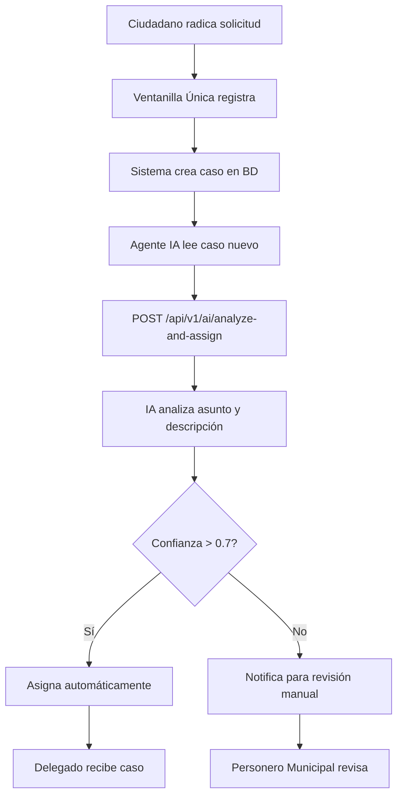
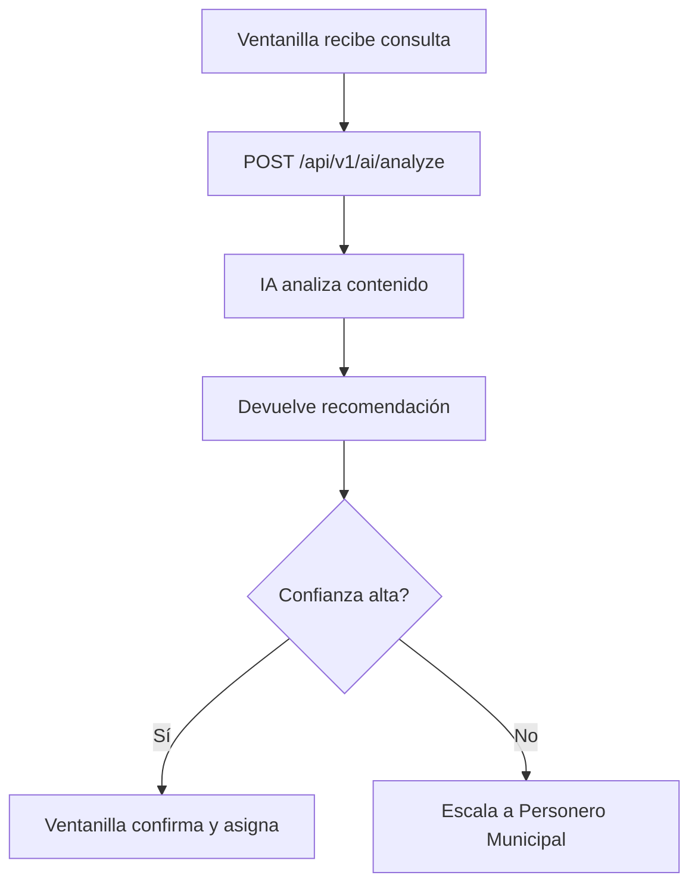

# Sistema de Asignación Inteligente de Casos - IA

## Descripción General

El sistema utiliza IA (Groq con modelo Llama 3.3 70B) para analizar solicitudes ciudadanas y asignarlas automáticamente al Personero Delegado más apropiado según la naturaleza del caso.

## Roles del Sistema

### Roles Administrativos
1. **ADMIN** - Administrador del sistema (nivel 100)
2. **PERSONERO_MUNICIPAL** - Máxima autoridad (nivel 100)
3. **VENTANILLA_UNICA** - Recepción y radicación (nivel 80)
4. **ASIGNACION_DE_CASOS** - Agente de IA (nivel 90) ⭐

### Roles de Personeros Delegados (nivel 85)
1. **DELEGADO_PARTICIPACION_CIUDADANA**
   - Participación ciudadana e interés público
   - Veedurías, control social, rendición de cuentas
   - Mecanismos de participación democrática

2. **DELEGADA_RAMA_JUDICIAL_SALUD**
   - Derecho a la salud (EPS, IPS, medicamentos)
   - Acciones de cumplimiento y habeas corpus
   - Juzgamiento disciplinario en primera instancia
   - ⚠️ **NO TUTELAS** (van al Personero Municipal)

3. **DELEGADO_VIGILANCIA_CONDUCTA_OFICIAL**
   - Vigilancia de servidores públicos
   - Contratación estatal
   - Prestación de servicios públicos domiciliarios

4. **DELEGADA_DDHH_MEDIO_AMBIENTE**
   - Derechos humanos fundamentales
   - Protección de poblaciones vulnerables
   - Defensa del medio ambiente

## ⚠️ REGLA CRÍTICA: Tutelas y Casos Prioritarios

**TODAS las acciones de tutela se asignan EXCLUSIVAMENTE al Personero Municipal.**

El Personero Municipal también recibe:
- Casos de vulneración grave de derechos fundamentales
- Asuntos de alto impacto institucional
- Denuncias de corrupción grave
- Casos complejos o ambiguos (confianza < 0.6)

## Endpoints de la API

### 1. Analizar y Asignar Automáticamente

**POST** `/api/v1/ai/analyze-and-assign`

Analiza una solicitud y la asigna automáticamente al delegado más apropiado.

**Autenticación:** Solo rol `ASIGNACION_DE_CASOS`

**Request Body:**
```json
{
  "caseId": "uuid-del-caso"
}
```

**Response Exitoso (200):**
```json
{
  "success": true,
  "data": {
    "message": "Caso asignado automáticamente por IA",
    "analysis": {
      "recommendedRole": "DELEGADA_RAMA_JUDICIAL_SALUD",
      "confidence": 0.92,
      "reasoning": "La solicitud menciona problemas con autorización de medicamentos y cirugía urgente de la EPS. Claramente es un caso de derecho a la salud que compete a la Personera Delegada para asuntos de salud.",
      "matchedKeywords": ["EPS", "medicamentos", "cirugía", "salud"],
      "alternativeRoles": []
    },
    "assignment": {
      "id": "assignment-uuid",
      "caseId": "case-uuid",
      "userId": "user-uuid",
      "assignedAt": "2026-01-26T10:30:00Z",
      "isReassignment": false
    }
  }
}
```

**Response Error (400):**
```json
{
  "success": false,
  "error": {
    "code": "ASSIGNMENT_FAILED",
    "message": "No hay funcionarios activos con el rol: DELEGADA_RAMA_JUDICIAL_SALUD"
  },
  "analysis": {
    "recommendedRole": "DELEGADA_RAMA_JUDICIAL_SALUD",
    "confidence": 0.92,
    "reasoning": "...",
    "matchedKeywords": ["EPS", "medicamentos"]
  }
}
```

### 2. Solo Analizar (sin asignar)

**POST** `/api/v1/ai/analyze`

Analiza una solicitud y devuelve recomendaciones sin ejecutar la asignación.

**Autenticación:** Roles `ASIGNACION_DE_CASOS`, `PERSONERO_MUNICIPAL`, `VENTANILLA_UNICA`

**Request Body (Opción 1 - Con caso existente):**
```json
{
  "caseId": "uuid-del-caso"
}
```

**Request Body (Opción 2 - Análisis directo):**
```json
{
  "subject": "Negación de medicamentos para hipertensión",
  "description": "La EPS Salud Total me negó la autorización de los medicamentos que me recetó el cardiólogo...",
  "caseType": "Derecho de Petición"
}
```

**Response (200):**
```json
{
  "success": true,
  "data": {
    "analysis": {
      "recommendedRole": "DELEGADA_RAMA_JUDICIAL_SALUD",
      "confidence": 0.88,
      "reasoning": "Caso relacionado con el derecho fundamental a la salud...",
      "matchedKeywords": ["EPS", "medicamentos", "salud"],
      "alternativeRoles": [
        {
          "role": "DELEGADA_DDHH_MEDIO_AMBIENTE",
          "confidence": 0.45
        }
      ]
    },
    "caseData": {
      "subject": "Negación de medicamentos para hipertensión",
      "caseType": "Derecho de Petición"
    }
  }
}
```

## Flujo de Trabajo del Agente IA

### Escenario 1: Asignación Automática al Recibir Caso



### Escenario 2: Análisis Previo sin Asignación



## Criterios de Análisis de la IA

### Nivel de Confianza

| Rango | Significado | Acción Recomendada |
|-------|-------------|-------------------|
| 1.0 | Tutela detectada | Asignación a PERSONERO_MUNICIPAL |
| 0.9 - 1.0 | Coincidencia perfecta | Asignación automática |
| 0.7 - 0.9 | Coincidencia clara | Asignación automática |
| 0.6 - 0.7 | Coincidencia razonable | Revisión sugerida |
| 0.0 - 0.6 | Confianza insuficiente | PERSONERO_MUNICIPAL |

### Palabras Clave por Competencia

#### Personero Municipal (PRIORIDAD MÁXIMA)
- **tutela**, acción de tutela, amparo constitucional
- perjuicio irremediable, urgencia constitucional
- corrupción grave, soborno, abuso de autoridad
- caso complejo, alto impacto, denuncia grave

#### Participación Ciudadana
- participación ciudadana, veedurías, control social
- audiencias públicas, cabildos abiertos
- consulta popular, revocatoria del mandato
- rendición de cuentas, transparencia

#### Rama Judicial y Salud (SIN TUTELAS)
- acción de cumplimiento, habeas corpus (NO tutela)
- EPS, IPS, salud, medicamentos, cirugías
- atención médica, urgencias
- proceso disciplinario, juzgamiento

#### Vigilancia y Servicios Públicos
- conducta oficial, servidor público, funcionario
- contratación estatal, licitación
- servicios públicos, agua, energía, gas
- corrupción, soborno, peculado

#### Derechos Humanos y Medio Ambiente
- derechos humanos, desplazamiento, violencia
- discriminación, población vulnerable
- adulto mayor, niñez, discapacidad
- medio ambiente, contaminación, deforestación

## Ejemplos de Casos

### Ejemplo 1: Tutela - Confianza Máxima (PERSONERO MUNICIPAL)

**Entrada:**
```json
{
  "subject": "Acción de tutela por negación de cirugía urgente",
  "description": "Solicito interponer acción de tutela contra la EPS Sanitas por negar autorización de cirugía de columna prescrita por neurocirujogo. Tengo hernia discal con perjuicio irremediable. Requiero amparo constitucional urgente."
}
```

**Análisis IA:**
```json
{
  "recommendedRole": "PERSONERO_MUNICIPAL",
  "confidence": 1.0,
  "reasoning": "TUTELA DETECTADA. Todas las acciones de tutela deben ser atendidas por el Personero Municipal como máxima autoridad. El caso menciona explícitamente 'acción de tutela' y 'amparo constitucional', requiere atención prioritaria.",
  "matchedKeywords": ["tutela", "acción de tutela", "amparo constitucional", "perjuicio irremediable"]
}
```

### Ejemplo 2: Salud (sin tutela) - Alta Confianza

**Entrada:**
```json
{
  "subject": "Solicitud de medicamentos autorizados por médico",
  "description": "La EPS Sanitas no me ha entregado los medicamentos que me recetó el cardiólogo hace 3 semanas. Necesito que intervengan para que cumplan con la orden médica."
}
```

**Análisis IA:**
```json
{
  "recommendedRole": "DELEGADA_RAMA_JUDICIAL_SALUD",
  "confidence": 0.85,
  "reasoning": "Caso de derecho a la salud sin mención de tutela. Se trata de cumplimiento de orden médica por parte de EPS, compete a la Personera Delegada para asuntos de salud.",
  "matchedKeywords": ["EPS", "medicamentos", "salud"]
}
```

**Entrada:**
```json
{
  "subject": "Solicitud de audiencia pública sobre presupuesto municipal",
  "description": "Como representante de la Junta de Acción Comunal del barrio El Recuerdo, solicitamos que se convoque una audiencia pública para explicar cómo se gastó el presupuesto de obras públicas del 2025."
}
```

**Análisis IA:**
```json
{
  "recommendedRole": "DELEGADO_PARTICIPACION_CIUDADANA",
  "confidence": 0.92,
  "reasoning": "Solicitud relacionada con mecanismo de participación ciudadana (audiencia pública) y control social sobre el presupuesto. Competencia clara del Delegado para Participación Ciudadana.",
  "matchedKeywords": ["audiencia pública", "participación", "control social", "presupuesto"]
}
```

### Ejemplo 3: Participación Ciudadana - Alta Confianza

**Entrada:**
```json
{
  "subject": "Solicitud de audiencia pública sobre presupuesto municipal",
  "description": "Como representante de la Junta de Acción Comunal del barrio El Recuerdo, solicitamos que se convoque una audiencia pública para explicar cómo se gastó el presupuesto de obras públicas del 2025."
}
```

**Análisis IA:**
```json
{
  "recommendedRole": "DELEGADO_PARTICIPACION_CIUDADANA",
  "confidence": 0.92,
  "reasoning": "Solicitud relacionada con mecanismo de participación ciudadana (audiencia pública) y control social sobre el presupuesto. Competencia clara del Delegado para Participación Ciudadana.",
  "matchedKeywords": ["audiencia pública", "participación", "control social", "presupuesto"]
}
```

### Ejemplo 4: Corrupción Grave - PERSONERO MUNICIPAL

**Entrada:**
```json
{
  "subject": "Denuncia de soborno en contratación de obras",
  "description": "Tengo evidencia de que el funcionario de contratación de la alcaldía está pidiendo dinero para adjudicar el contrato de pavimentación. Tengo grabaciones y documentos que lo prueban."
}
```

**Análisis IA:**
```json
{
  "recommendedRole": "PERSONERO_MUNICIPAL",
  "confidence": 0.95,
  "reasoning": "Denuncia grave de corrupción administrativa con evidencia. Por la gravedad del caso y el alto impacto institucional, debe ser atendido directamente por el Personero Municipal.",
  "matchedKeywords": ["soborno", "corrupción", "denuncia grave"]
}
```

### Ejemplo 5: Medio Ambiente - Confianza Media

**Entrada:**
```json
{
  "subject": "Contaminación del río Guadalajara",
  "description": "Varias empresas están arrojando desechos al río. Los peces están muriendo y el agua huele mal. ¿Qué podemos hacer?"
}
```

**Análisis IA:**
```json
{
  "recommendedRole": "DELEGADA_DDHH_MEDIO_AMBIENTE",
  "confidence": 0.78,
  "reasoning": "Caso de afectación ambiental que requiere defensa del derecho a un medio ambiente sano. Compete a la Delegada para Medio Ambiente, aunque podría requerir coordinación con autoridades ambientales.",
  "matchedKeywords": ["contaminación", "río", "medio ambiente"],
  "alternativeRoles": [
    {
      "role": "DELEGADO_VIGILANCIA_CONDUCTA_OFICIAL",
      "confidence": 0.35
    }
  ]
}
```

### Ejemplo 4: Caso Complejo - Confianza Baja (Requiere Escalamiento)

**Entrada:**
```json
{
  "subject": "Problema con servicios de la alcaldía",
  "description": "Tengo un problema con la alcaldía pero no sé bien a quién dirigirme."
}
```

**Análisis IA:**
```json
{
  "recommendedRole": "DELEGADO_VIGILANCIA_CONDUCTA_OFICIAL",
  "confidence": 0.42,
  "reasoning": "Descripción demasiado vaga para determinar competencia específica. Se recomienda que el Personero Municipal realice entrevista inicial para clasificar adecuadamente.",
  "matchedKeywords": ["alcaldía", "servicios"],
  "alternativeRoles": [
    {
      "role": "PERSONERO_MUNICIPAL",
      "confidence": 0.80
    }
  ]
}
```
⚠️ En este caso, el sistema debería escalar al Personero Municipal para clasificación manual.

## Configuración

### Variables de Entorno

Asegúrate de tener configurada la API key de Groq en tu archivo `.env`:

```env
# IA - Groq (Asistente IA)
GROQ_API_KEY="gsk_xxxxxxxxxxxxxxxxxxxxxxxxxxxxxxxxxxxxxxxx"  # tu propia API key
```

### Modelo de IA

El sistema utiliza:
- **Modelo:** `llama-3.3-70b-versatile`
- **Temperatura:** 0.3 (respuestas consistentes y predecibles)
- **Max Tokens:** 1024
- **Formato:** JSON estructurado

## Monitoreo y Métricas

### Métricas Recomendadas a Implementar

1. **Precisión de Asignaciones**
   - % de casos correctamente asignados
   - % de reasignaciones necesarias

2. **Distribución de Confianza**
   - Promedio de nivel de confianza
   - Distribución por rangos

3. **Tiempos de Procesamiento**
   - Tiempo promedio de análisis
   - Tiempo total incluyendo asignación

4. **Casos por Delegado**
   - Distribución de carga de trabajo
   - Balance entre delegados

## Seguridad

- ✅ Solo el rol `ASIGNACION_DE_CASOS` puede ejecutar asignaciones automáticas
- ✅ Todas las asignaciones se auditan con IP, user-agent y timestamp
- ✅ El razonamiento de la IA se guarda en el registro de asignación
- ✅ La API key de Groq está en variable de entorno (no en código)

## Próximos Pasos

1. Implementar interfaz web para visualizar análisis de IA
2. Agregar dashboard de métricas de asignación automática
3. Crear sistema de feedback para mejorar el modelo
4. Implementar notificaciones cuando confianza < 0.5
5. Agregar logs estructurados para análisis de patrones
